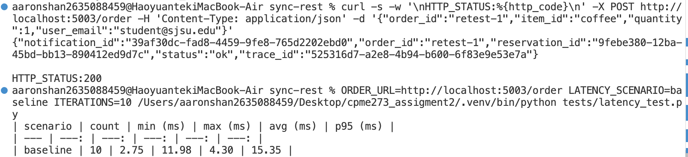
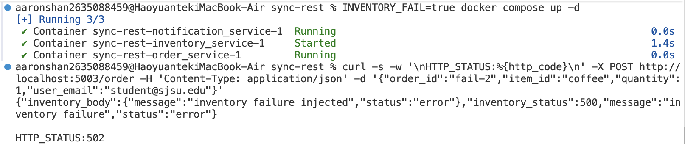
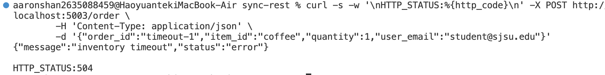
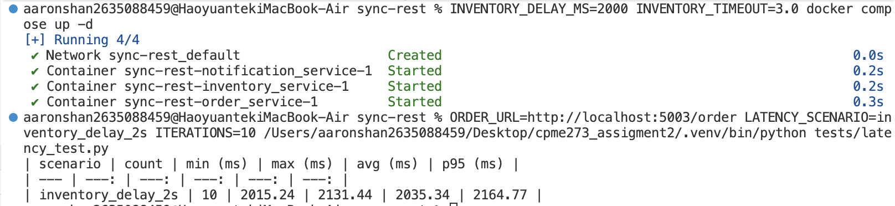

# Part A - Synchronous REST

This folder contains the synchronous REST workflow for campus food ordering.

## Services

- Order Service: `POST /order`
- Inventory Service: `POST /reserve`
- Notification Service: `POST /send`

## Docker-based testing (commands + expected output)

### 1) Start the stack

```bash
docker compose up -d --build
```

### 2) Normal request (expected 200)

```bash
curl -s -w '\nHTTP_STATUS:%{http_code}\n' -X POST http://localhost:5003/order \
	-H 'Content-Type: application/json' \
	-d '{"order_id":"normal-1","item_id":"coffee","quantity":1,"user_email":"student@sjsu.edu"}'
```

Expected output:

- Status: `HTTP_STATUS:200`
- JSON includes: `status="ok"`, `reservation_id`, `notification_id`, `trace_id`




### 3) Inventory failure (expected 502)

```bash
INVENTORY_FAIL=true docker compose up -d
curl -s -w '\nHTTP_STATUS:%{http_code}\n' -X POST http://localhost:5003/order \
	-H 'Content-Type: application/json' \
	-d '{"order_id":"fail-1","item_id":"coffee","quantity":1,"user_email":"student@sjsu.edu"}'
```

Expected output:

- Status: `HTTP_STATUS:502`
- JSON includes: `message="inventory failure"`



### 4) Inventory timeout (expected 504)

```bash
INVENTORY_DELAY_MS=2000 INVENTORY_TIMEOUT=1.0 docker compose up -d
curl -s -w '\nHTTP_STATUS:%{http_code}\n' -X POST http://localhost:5003/order \
	-H 'Content-Type: application/json' \
	-d '{"order_id":"timeout-1","item_id":"coffee","quantity":1,"user_email":"student@sjsu.edu"}'
```

Expected output:

- Status: `HTTP_STATUS:504`
- JSON includes: `message="inventory timeout"`



### 5) Stop the stack

```bash
docker compose down
```

## Failure and delay injection

- Add a 2s inventory delay: set `INVENTORY_DELAY_MS=2000` when starting compose.
- Inject inventory failure: set `INVENTORY_FAIL=true`.
- Order uses `INVENTORY_TIMEOUT` (default 1s). If delay exceeds timeout, Order returns `504`.

## Tests

```bash
pytest
```

### Grader instructions (running tests from a fresh checkout)

```bash
cd sync-rest
python -m venv .venv
source .venv/bin/activate
pip install -r requirements.txt
python -m pytest
python3 -m pytest
```

To see per-test input/expected/actual prints:

```bash
python -m pytest -v -s
python3 -m pytest -v -s
```

### Test inputs and expected outputs

| Test | Input (summary) | Expected status | Expected JSON (summary) | Why it passes |
| --- | --- | ---: | --- | --- |
| `test_reserve_success` | `POST /reserve` with `order_id`, `item_id`, `quantity` | 200 | `status="reserved"`, `reservation_id` | Inventory reserves successfully. |
| `test_reserve_failure` | `POST /reserve` with `INVENTORY_FAIL=true` | 500 | `status="error"` | Failure injection returns server error. |
| `test_reserve_missing_fields` | `POST /reserve` missing fields | 400 | `status="error"`, `fields` | Validates required fields. |
| `test_send_success` | `POST /send` with `order_id`, `user_email` | 200 | `status="sent"`, `notification_id` | Notification succeeds. |
| `test_send_missing_fields` | `POST /send` missing fields | 400 | `status="error"`, `fields` | Validates required fields. |
| `test_order_success` | `POST /order` with full payload | 200 | `status="ok"`, `reservation_id`, `notification_id` | Inventory + notification succeed. |
| `test_order_inventory_timeout` | Inventory request times out | 504 | `status="error"`, `message="inventory timeout"` | Order times out on inventory. |
| `test_order_missing_fields` | `POST /order` missing fields | 400 | `status="error"`, `fields` | Validates required fields. |
| `test_order_inventory_failure` | Inventory returns 500 | 502 | `status="error"`, `message="inventory failure"` | Order handles upstream failure. |

## Latency table

The latency script prints a Markdown table for a named scenario:

```bash
ORDER_URL=http://localhost:5003/order LATENCY_SCENARIO=baseline ITERATIONS=10 python tests/latency_test.py
```

Run the baseline table first, then re-run with `INVENTORY_DELAY_MS=2000` and `LATENCY_SCENARIO=inventory_delay_2s` to capture the delayed case. Use `INVENTORY_TIMEOUT=3.0` so the order call waits long enough to measure the delay.

### Latency results




| scenario | count | min (ms) | max (ms) | avg (ms) | p95 (ms) |
| --- | ---: | ---: | ---: | ---: | ---: |
| baseline | 10 | 2.62 | 13.75 | 5.03 | 14.83 |
| inventory_delay_2s | 10 | 2015.24 | 2131.44 | 2035.34 | 2164.77 |

### Latency reasoning

- This is a synchronous flow, so Order waits for Inventory and Notification before replying.
- If Inventory is slow by ~2 seconds, the total Order time also goes up by about 2 seconds.
- When Inventory fails or times out, Order stops early and returns an error instead of calling Notification.

## In-class activity

- **Acceptable failure:** Inventory timeout or failure causes Order to fail fast.
- **What user sees:** Order request fails with 502/504.
- **What keeps working:** Notification is skipped; unrelated services remain healthy.
- **Mistake to avoid:** Missing timeouts (requests hang indefinitely).
